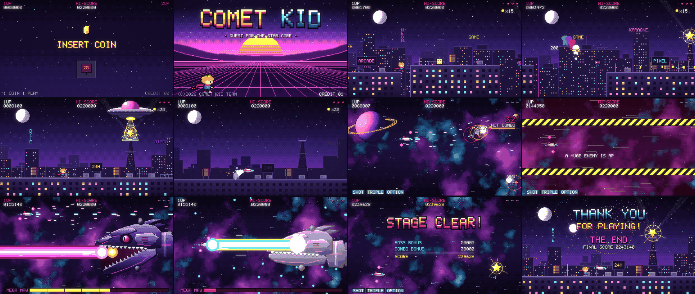

# COMET KID — a pixel arcade short

A 98-second, 1080p60 retro arcade video. Every pixel, note and sound effect is
generated from code in this folder. There are no image, audio or font assets.



**Watch:** [`output/comet_kid.mp4`](output/comet_kid.mp4) (1920×1080, 60 fps, H.264 + AAC stereo)

## The story

| Time | Scene | What happens |
|------|-------|--------------|
| 0:00 | **Insert coin** | The arcade tube warms up, a coin drops into the slot, CREDIT 01. |
| 0:03 | **Title** | Synthwave sunset. `COMET KID` slams down letter by letter on the beat, then the hero strikes a pose. |
| 0:13 | **Stage 1: Neon City** | A rooftop run choreographed to the music: coin arcs, stomps, a crate smash into *Comet Mode* (rainbow afterimages), and a drone bounce chain. A UFO steals the Star Core from the city's tower, the city blacks out, and Comet Kid blasts off after it. |
| 0:32 | **Stage 2: Starway** | Side-scrolling shoot-'em-up: enemy formations, asteroid fields, mines, a carrier. The ship picks up triple shot and orbiting options and racks up a 70+ hit combo. |
| 0:51 | **Warning!!** | Hazard stripes, sirens. |
| 0:54 | **Boss: MEGA MAW** | A mechanical skull-dragon attacks with bullet rings, turret fire, fireballs, a mouth laser and rage-mode spirals. It falls to the **Comet Beam**. |
| 1:17 | **Stage clear** | Bonus tally, and a new high score. |
| 1:23 | **Ending** | The Star Core returns and the city's lights sweep back on. Fireworks go off on the beat, THE END, and the tube switches off. |

## How it's made

- **Resolution and style.** Everything is drawn on a 384×216 canvas with a hand-tuned palette and ordered (Bayer) dithering. The canvas is upscaled 5× with nearest-neighbour sampling to exactly 1920×1080, so every pixel is a crisp 5×5 block. A soft neon bloom and a light vignette are then composited at full resolution.
- **Sprites.** The hero, enemies, ships and pickups are hand-drawn as ASCII art in `sprites.py`. The hero is assembled from head, torso and leg-cycle parts, with a physics-driven scarf.
- **Procedural set pieces.** The 168 px boss is built from polygons with bevel shading and has a hinged, animated jaw (`boss.py`). Planets, asteroids and the Star Core are procedurally shaded (`procgen.py`). The neon skyline, nebula clouds and synthwave grid are generated in `backgrounds.py` and `scenes/city.py`.
- **Everything is on the beat.** The video runs at 150 BPM, which is exactly 24 frames per beat. Jumps, stomps, coin pickups, enemy waves, boss attacks and fireworks are all scheduled on that grid, so the action locks to the soundtrack.
- **The shoot-'em-up plays itself.** An autopilot simulates bullets 18 frames ahead to pick safe, aggressive moves, and enemies are shot down by real collisions.
- **Audio from scratch** (`audio/`):
  - A chiptune synth with band-limited (PolyBLEP) pulse waves, an NES-style 4-bit triangle bass and noise drums.
  - A score written bar by bar in `score.py`. The hero's leitmotif opens the title theme, returns in D major for the Comet Beam, and closes the ending.
  - About 50 synthesized sound effects, fired from the simulation's event log and panned by on-screen position.
  - Mastering with ping-pong delay, convolution reverb and a lookahead limiter, to about −14 LUFS with true peaks at or below −1 dBTP.
- **Photosensitivity.** There are no large-area strobes. Hit feedback uses steady tints or small flashes, and full-screen flashes happen only once per event.

## Render it yourself

```bash
pip install -r pixel_arcade/requirements.txt       # bundles its own ffmpeg via imageio-ffmpeg
python -m pixel_arcade.render                       # full quality -> pixel_arcade/output/comet_kid.mp4 (~10 min)
python -m pixel_arcade.render --draft               # 960x540 quick look (~3 min)
python -m pixel_arcade.render --draft --bars 34:48  # only the boss fight
python -m pixel_arcade.preview space 1500,2420 sheet.png   # contact sheet of chosen frames of a scene
```

The simulation is deterministic, so every run produces the same video.

## Layout

```
pixel_arcade/
  engine.py      canvas, sprites, text, dithering, particles
  post.py        5x upscale, bloom, vignette, CRT on/off, ffmpeg pipes
  palette.py     colours and colour ramps
  font.py        5x7 arcade bitmap font
  sprites.py     hand-drawn sprites        hero.py      hero compositor + scarf
  procgen.py     procedural shading        boss.py      MEGA MAW
  props.py       Star Core, tower, UFO     logo.py      extruded logo letters
  backgrounds.py starfields, synthwave, nebula space
  scene.py       shared context, HUD, wipes, stage cards
  timeline.py    scene order and lengths (in bars)
  scenes/        boot, title, city, space (shmup + boss + clear), ending
  audio/         synth.py, sfx.py, score.py, mix.py
  render.py      entry point              preview.py   contact-sheet helper
```
